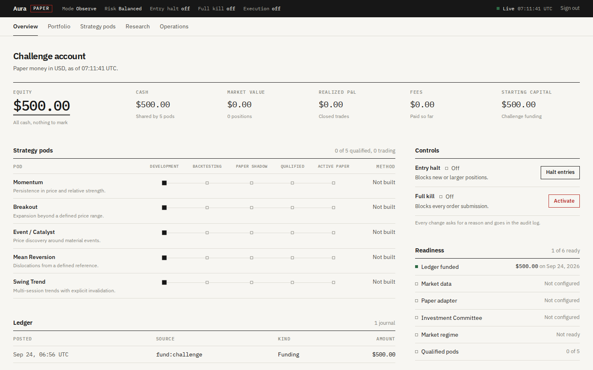
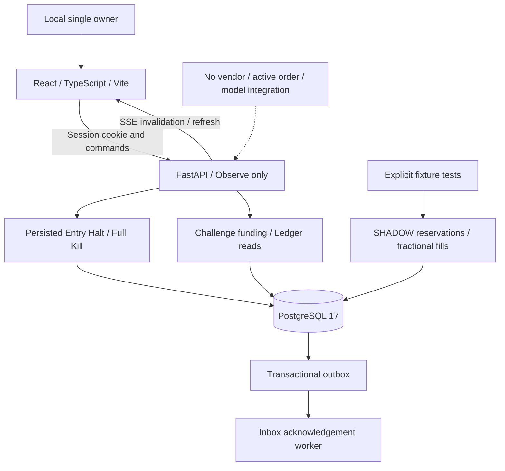

# Aura

A single-owner research workspace for US-listed stocks and ETFs. It is designed to scan for trading opportunities, have an AI "investment committee" argue for and against them, and paper-trade the survivors under deterministic risk controls.

> **Status: paused (September 2026).** Aura is not under active development. The foundation described below runs and is tested. The trading intelligence (market data, strategies, AI analysis) exists only as design documents. Aura is paper-only by design, with no code path to a real broker or real money. Nothing here is investment advice or evidence that any strategy works.



## What's in the repo

- **A runnable foundation:** an authenticated web app, a double-entry accounting ledger, safety controls, event plumbing, 24 backend tests and Playwright browser tests.
- **A full design package:** an 18-chapter [Design Bible](docs/design-bible/README.md), 23 [architecture decision records](docs/adr/README.md) and 20 [Mermaid diagrams](docs/diagrams/README.md). Together they cover the complete platform: strategy pods, a deterministic market-regime engine, a multi-role AI committee, portfolio and risk management, paper execution and an offline evaluation league.

## What works

| Area | Implemented |
|---|---|
| Web workspace | React / TypeScript / Vite / Tailwind: portfolio and ledger records, strategy-pod registry, research readiness, dependency health and owner controls. Live updates over Server-Sent Events, with an authoritative refetch on reconnect. |
| Owner auth | Single-owner key sign-in. Session tokens are stored server-side as SHA-256 hashes, expire after 8 hours and can be revoked. HttpOnly `SameSite=Strict` cookie, origin checks on commands, 5-attempts-per-minute sign-in throttle, loopback-only servers. |
| Ledger | Balanced, append-only, transaction-sealed double-entry journals in PostgreSQL, using decimal arithmetic. A once-only $500.00 simulated starting balance. |
| Safety controls | Persistent, audited **Entry Halt**, which blocks new or larger positions, and **Full Kill**, which blocks all order submissions. Both are driven by idempotent, version-checked owner commands. Re-arming after Full Kill fails closed until real reconciliation checks exist. |
| Execution primitives (tests only) | Simulated "SHADOW" fills: shared cash and exit reservations, fractional FIFO fills, duplicate and conflicting order IDs. An order with an unknown outcome keeps its capacity reserved instead of being blindly resubmitted. |
| Events | Transactional outbox with a durable competing-consumer inbox. |
| Contracts | OpenAPI schema exported from FastAPI, with TypeScript types generated from it. |
| Operations | Idempotent Windows bootstrap and dev scripts. A backup/restore drill that checks the accounting in a disposable restored copy. |

## What doesn't exist

There is no market data feed, AI model or broker connection. The five strategy methodologies (Momentum, Breakout, Event/Catalyst, Mean Reversion, Swing Trend) are registered but unimplemented. The app runs in Observe mode only and has no order-submission endpoint, so it cannot place a trade, not even a simulated one. [Implementation status](docs/IMPLEMENTATION_STATUS.md) lists the gaps module by module.

## Architecture

The implemented slice:



The target design is an event-driven modular monolith. Its load-bearing rules:

- Deterministic code computes features, position sizes and risk. AI supplies structured evidence and proposals. It can never submit orders or override risk limits.
- One ledger owns all accounting: decimal amounts, idempotent effects, point-in-time data and auditable state transitions.
- Order Manager → Broker Interface → Paper Broker Adapter is the only way to execute a trade, and no live adapter exists.
- Each strategy version must qualify on paper, separately for each time horizon, before it receives any simulated capital.

## Tech stack

Python 3.12, FastAPI, SQLAlchemy 2, Alembic, PostgreSQL 17, uv · React 19, TypeScript, Vite 7, Tailwind CSS 4 · pytest, Ruff, mypy (strict), Playwright

## Run it locally (Windows PowerShell)

You need Node 22.12+, [uv](https://docs.astral.sh/uv/), and either Docker Desktop or the PostgreSQL 17 binaries.

```powershell
./scripts/bootstrap.ps1 -NativePostgres   # PostgreSQL 17 installed at C:\Program Files\PostgreSQL\17\bin
./scripts/bootstrap.ps1                   # or, with Docker Desktop running
npm run dev
```

Open http://127.0.0.1:5173 and sign in with `AURA_OWNER_KEY` from the generated `.env`. The key is never printed or committed, so keep `.env` private. Bootstrap is idempotent. The native setup creates an isolated cluster under `.cache/postgres` on port 55432 and leaves any existing PostgreSQL services alone.

`npm run dev` starts PostgreSQL, the API and the worker, then Vite. Logs go to `.cache/`. To stop the native cluster:

```powershell
& 'C:\Program Files\PostgreSQL\17\bin\pg_ctl.exe' -D .cache/postgres -m fast -w stop
```

## Tests and checks

```powershell
./scripts/check.ps1                            # Ruff, mypy, 13 domain tests, production web build
./scripts/test-integration.ps1                 # 11 PostgreSQL tests on a dedicated aura_test database
./scripts/contracts.ps1                        # Regenerate the OpenAPI schema and TypeScript types
npm run test:e2e                               # Playwright browser tests; needs the running app and Chrome
uv run python scripts/backup_restore_check.py  # Restore drill (native PostgreSQL 17)
```

## Repository map

| Path | Contents |
|---|---|
| `packages/aura/src/aura` | Domain modules: ledger, execution, risk, strategies, regime, events, auth, API |
| `apps/api` | API entry point |
| `apps/web` | React workspace |
| `infra/migrations` | Forward-only Alembic migrations |
| `packages/contracts` | Generated OpenAPI schema |
| `tests` | Domain, PostgreSQL integration and browser tests |
| `scripts` | Windows bootstrap, dev, check and maintenance scripts |
| `docs` | Design Bible, ADRs, diagrams, status |
| [`Aura_Seed.md`](Aura_Seed.md) | The original product brief |

## License

[MIT](LICENSE)
